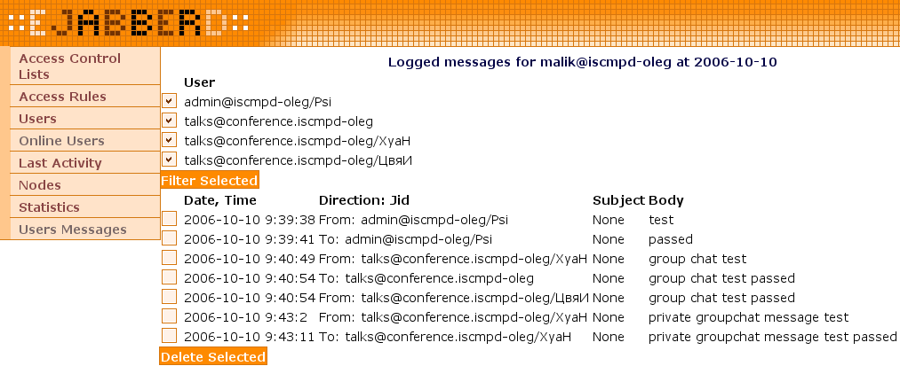

# [mod_logdb](https://paleg.github.io/mod_logdb/)

mod_logdb - module for [ejabberd](https://www.ejabberd.im/) for logging user messages to db (`mnesia`, `mysql`, `pgsql` now supported).

Your pull requests are welcome in [github](https://github.com/paleg/ejabberd) (use recent [XX.XX-mod_logdb](https://github.com/paleg/ejabberd/tree/17.04-mod_logdb) branch).

**Table of Contents**

- [General notes](#general-notes)
- [Overview](#overview)
- [Install](#install)
    - [Manually from sources](#manually-from-sources)
    - [Building debian package](#building-debian-package)
    - [Installing with git (ejabberd is already installed)](#installing-with-git-ejabberd-is-already-installed)
    - [FreeBSD](#freebsd)
- [Configure](#configure)
    - [Configuration examples](#configuration-examples)
        - [YAML](#yaml)
        - [Erlang](#erlang)
    - [Configuration options](#configuration-options)
        - [dbs](#dbs)
        - [vhosts](#vhosts)
        - [ignore_jids](#ignore_jids)
        - [groupchat](#groupchat)
        - [purge_older_days](#purge_older_days)
        - [dolog_default](#dolog_default)
        - [poll_users_setting](#poll_users_setting)
    - [ACL configuration](#acl-configuration)
- [Manage (ejabberdctl commands)](#manage-ejabberdctl-commands)
    - [copy messages from given backend to current backend](#copy-messages-from-given-backend-to-current-backend)
    - [rebuild statistics for vhost](#rebuild-statistics-for-vhost)
- [Usage](#usage)
    - [Ad-hoc interface](#ad-hoc-interface)
    - [Web interface (admin)](#web-interface-admin)

## General notes
* module development is tracking ejabberd version shipped with **debian stable**. If you need module for recent ejabberd releases feel free to [contact me](mailto:o.palij@gmail.com)
* this module still is under development, so backward compatibility is not guaranteed
* if you are upgrading from earlier versions, **make sure that you have backup of database**, before upgrade.

## Overview
* this module sniffs all user messages send through ejabberd
* it logs messages to selected database (`mnesia`, `mysql`, `pgsql`)
* logged messages can be viewed through ejabberd web admin interface
* module settings and user settings can be changed by admin/user via ad-hoc commands
* user logging settings can be changed via web admin console.

## Install

### Manually from sources
Download mod_logdb patch for desired ejabberd version:
* [18.06](https://github.com/paleg/ejabberd/compare/paleg:18.06...paleg:18.06-mod_logdb.patch) (should be compatible from 18.06)
* [17.04](https://github.com/paleg/ejabberd/compare/paleg:17.04...paleg:17.04-mod_logdb.patch) (should be compatible from 17.04)
* [16.04](https://github.com/paleg/ejabberd/compare/paleg:16.04...paleg:16.04-mod_logdb.patch) (should be compatible from 16.04)
* [15.07](https://github.com/paleg/ejabberd/compare/paleg:15.07...paleg:15.07-mod_logdb.patch) (should be compatible from 15.06)
* [14.07](https://github.com/paleg/ejabberd/compare/paleg:14.07...paleg:14.07-mod_logdb.patch) (should be compatible up to 15.02)
* [13.12](https://github.com/paleg/ejabberd/compare/paleg:13.12...paleg:13.12-mod_logdb.patch).

Approximate sequence for 17.04 on debian jessie/stretch:
```bash
apt-get install erlang erlang-dev automake autoconf libyaml-dev libexpat1-dev
cd /usr/local/src
wget https://www.process-one.net/downloads/downloads-action.php?file=/ejabberd/17.04/ejabberd-17.04.tgz --trust-server-names
tar zxvf ejabberd-17.04.tgz
cd ejabberd-17.04
curl -q https://github.com/paleg/ejabberd/compare/paleg:17.04...paleg:17.04-mod_logdb.patch | patch -p1 --remove-empty-files
./autogen.sh
./configure --enable-user=ejabberd --enable-odbc --enable-mysql --enable-pgsql --enable-zlib --enable-iconv
make && make install
```

### Building debian package

```bash
cd /usr/local/src
apt-get source ejabberd
cd ejabberd-14.07
apt-get install quilt
export QUILT_PATCHES=debian/patches
quilt push -a
quilt new 99_patch-mod_logdb-14.07.diff
quilt add rebar.config.script
quilt add priv/msgs/nl.msg
quilt add priv/msgs/pl.msg
quilt add priv/msgs/ru.msg
quilt add priv/msgs/uk.msg
quilt add src/gen_logdb.erl
quilt add src/mod_logdb.erl
quilt add src/mod_logdb.hrl
quilt add src/mod_logdb_mnesia.erl
quilt add src/mod_logdb_mysql.erl
quilt add src/mod_logdb_mysql5.erl
quilt add src/mod_logdb_pgsql.erl
quilt add src/mod_muc_room.erl
quilt add src/mod_roster.erl
curl -q https://github.com/paleg/ejabberd/compare/paleg:14.07...paleg:14.07-mod_logdb.patch | patch -p1 --remove-empty-files
quilt refresh
quilt pop -a
apt-get build-dep ejabberd
apt-get install devscripts
debuild -uc -us
```

ejabberd debian package with mod_logdb should be in `../ejabberd_14.07*.deb`

If you are planning to use `mysql5` backend you should recompile `erlang-p1-mysql` package too:
```bash
cd /usr/local/src
apt-get source erlang-p1-mysql
cd erlang-p1-mysql-0.2014.03.10/
export QUILT_PATCHES=debian/patches
quilt new 99_multi.diff
quilt add src/p1_mysql_auth.erl
curl -q https://github.com/paleg/p1_mysql/compare/paleg:1.0.2...paleg:multi.patch | patch -p1 --remove-empty-files
quilt refresh
quilt pop -a
apt-get build-dep erlang-p1-mysql
debuild -uc -us
```

erlang-p1-mysql debian package with multi patch applied should be in `../erlang-p1-mysql_*.deb`

### Installing with git (ejabberd is already installed)
Note:
* you should use branch corresponded to ejabberd installed version
* `EJABBERD_PREFIX` must hold path to installed ejabberd files (`/usr/lib/x86_64-linux-gnu/ejabberd` in debian).

```bash
cd /usr/local/src
git clone https://github.com/paleg/ejabberd
cd ejabberd
git checkout 14.07-mod_logdb
./autogen.sh
./configure --enable-odbc --enable-mysql --enable-pgsql --enable-pam --enable-zlib --enable-json --enable-iconv --enable-lager --enable-transient_supervisors
make
cp -v ebin/mod_logdb* ${EJABBERD_PREFIX}/ebin/
cp ebin/mod_muc_room.beam ${EJABBERD_PREFIX}/ebin/
cp ebin/mod_roster.beam ${EJABBERD_PREFIX}/ebin/
cp priv/msgs/{nl,pl,ru,uk}.msg ${EJABBERD_PREFIX}/priv/msgs/
```

### FreeBSD

First do cleanup:
```bash
cd /usr/ports/net-im/ejabberd && make deinstall
rm -rf /usr/local/lib/erlang/lib/ejabberd-*
```

Then install:
```bash
cd /usr/ports/net-im/ejabberd
make patch
cd work
tag=$(echo p1_mysql-* | cut -d '-' -f 2)
cd ejabberd-*/deps/
rm -rf p1_mysql
git clone https://github.com/paleg/p1_mysql.git && cd p1_mysql && git checkout ${tag}_multi
cd /usr/ports/net-im/ejabberd/work/ejabberd-*/
curl -q https://github.com/paleg/ejabberd/compare/paleg:18.06...paleg:18.06-mod_logdb.patch | patch -p1 --remove-empty-files
cd /usr/ports/net-im/ejabberd
cat <<EOF >> pkg-plist
%%EJABBERD_LIBDIR%%/%%PORTNAME%%-%%PORTVERSION%%/ebin/mod_logdb.beam
%%EJABBERD_LIBDIR%%/%%PORTNAME%%-%%PORTVERSION%%/ebin/gen_logdb.beam
%%EJABBERD_LIBDIR%%/%%PORTNAME%%-%%PORTVERSION%%/ebin/mod_logdb_mysql5.beam
%%EJABBERD_LIBDIR%%/%%PORTNAME%%-%%PORTVERSION%%/ebin/mod_logdb_mysql.beam
%%EJABBERD_LIBDIR%%/%%PORTNAME%%-%%PORTVERSION%%/ebin/mod_logdb_pgsql.beam
%%EJABBERD_LIBDIR%%/%%PORTNAME%%-%%PORTVERSION%%/ebin/mod_logdb_mnesia.beam
EOF
make install
```

No further steps required. Just start it and it should work with mysql5 backend.

## Configure

### Configuration examples
* you have two domains `example1.org` and `example2.org`
* you want to log messages for `example1.org` into `mysql5` and messages for `example2.org` into `mnesia`.

#### YAML
Indentation matters (recent XX.XX versions).

```yaml
modules:
  # Other modules ...
  mod_logdb:
    dbs:
      mnesia: []
      mysql5:
        server: "serv"
        port: 3306
        db: "logdb"
        user: "user"
        password: "passwd"
    vhosts:
      "example1.org": mysql5
      "example2.org": mnesia
    groupchat: send
    dolog_default: true
    ignore_jids:
      - "bigboss@example.com"
      - "bot@example.org"
      - "@rss.example.org"
```

#### Erlang
Old 2.x.x versions.

```erlang
{modules, [
  {mod_logdb, [
    {dbs, [
      {mysql5, [
        {user, "root"},
        {password, "pass"},
        {server, "serv"},
        {port, 3306},
        {db, "logdb"}
      ]},
      {mnesia, []}
    ]},
    {vhosts, [{"example1.org", mysql5}, {"example2.org", mnesia}]},
    {ignore_jids, ["bigboss@example.com", "bot@example.org", "@rss.example.org"]},
    {groupchat, none},
    {purge_older_days, 365},
    {dolog_default, true},
    {poll_users_settings, 5}
  ]},

  %% Other modules ...

]}.
```

### Configuration options

#### dbs
Describes db parameters in format `{dbs, [{db_backend_name, [db_backend_opts]}, ... ]}`

Currently supported backends:
* `mnesia`
* `mysql` - can be used both with mysql v4 and mysql v5.
* `mysql5` - can be used only with mysql v5. This backend (in comparison with mysql backend) move most of work to mysql server, so it should decrease load of jabber server.
* `pgsql` - uses the same technics as mysql5 backend.

Default value `[{mnesia, []}]` - only mnesia supported.

Examples:
```yaml
dbs:
  mnesia: []
  pgsql:
    user: "postgres"
    password: "pass"
    server: "serv"
    port: 5432
    db: "logdb"
    schema: "test"
  mysql5:
    user: "root"
    password: "pass"
    server: "serv"
    port: 3306
    db: "logdb5"
  mysql:
    user: "root"
    password: "pass"
    server: "serv"
    port: 3306
    db: "logdb5"
```

```erlang
{dbs, [{pgsql,
        [{user, "postgres"},
         {password, "pass"},
         {server, "serv"},
         {port, 5432},
         {db, "logdb"},
         {schema, "test"}
        ]
       },
       {mysql5,
        [{user, "root"},
         {password, "pass"},
         {server, "serv"},
         {port, 3306},
         {db, "logdb"}
        ]
       },
       {mysql,
        [{user, "root"},
         {password, "pass"},
         {server, "serv"},
         {port, 3306},
         {db, "logdb"}
        ]
       },
       {mnesia, []}
      ]
}
```

#### vhosts
Defines domains served by ejabberd for which you want to log messages in format `{vhosts, [{"vhost_name", db_backend_name}, ... ]}`.

Each `db_backend_name` must be described in `dbs` section.

Does not have default value.

Examples:
```yaml
vhosts:
  "example1.org": mysql5
  "example2.org": mnesia
  "example3.org": pgsql
```
```erlang
{vhosts,
  [
    {"example1.org", mysql5},
    {"example2.org", mnesia},
    {"example3.org", pgsql}
  ]
}
```

#### ignore_jids
Ignores messages sent to or from JIDs/Domains in the list. Domains must start with @.

Default value - `[]`.

Examples:
```yaml
ignore_jids:
  - "bigboss@example.com"
  - "bot@example.org"
  - "@rss.example.org"
```
```erlang
{ignore_jids, ["bot@example.org", "@headlines.example.org"]}
```

#### groupchat
Defines how to process groupchat messages.

Possible values:
* `all` - to log all groupchat messages
* `send` - to log only sent by user messages
* `none` - to disable logging of groupchat messages (recommended value, use `mod_muc_log` for groupchat logging).

Default value - `none`.

Examples:
```yaml
groupchat: all
```
```erlang
{groupchat, send}
```

#### purge_older_days
For automatic purging of messages older than specified value.

Possible values:
* `never` - do not perform automatic purging of messages
* `Number` - perform daily automatic purging of messages older than Number (in days). To keep only "today's" messages set Number to 0.

Default value - `never`.

Examples:
```yaml
purge_older_days: 0
```
```erlang
{purge_older_days, 4}
```

#### dolog_default
Defines if module will store messages by defaut.

Possible values:
* `true` - log messages by default
* `false` - do not log messages by default.

Default value - `true`.

Examples:
```yaml
dolog_default: false
```
```erlang
{dolog_default, false}
```

#### poll_users_setting
Defines time interval for module to poll db for user settings.

Possible values:
* `0` - disable polling
* `Number` - poll database every Number (in seconds).

This can be set to `0` if you are not planning to directly edit db and you are not using module in clustered environment.

Default value - `10`.

Examples:
```yaml
poll_users_setting: 0
```
```erlang
{poll_users_setting, 0}
```

### ACL configuration
This allows all users to change their logging preferences via ad-hoc commands:
```yaml
access:
  # other access rules ...
  mod_logdb:
    all: allow
```
```erlang
{access, mod_logdb, [{allow, all}]}
```

This allows admins to change module/users settings via ad-hoc commands:
```yaml
access:
  # other access rules ...
  mod_logdb_admin:
    admin: allow
```
```erlang
{access, mod_logdb_admin, [{allow, admin}]}
```

## Manage (ejabberdctl commands)

### copy messages from given backend to current backend
`$ ejabberdctl ejabberd@your-server vhost you-vhost-here copy_messages backend <date>|all`

E.g. you initially used `mysql` backend and now you want to switch to `pgsql` backend:
* make sure that both backends described in module config `dbs` section
* reconfigure module to use `pgsql` backend
* restart module/server, then try:
    + for all stored messages - `$ ejabberdctl ejabberd@your-server vhost you-vhost copy_messages mysql all`
    + for messages at given date - `$ ejabberdctl ejabberd@your-server vhost you-vhost copy_messages mysql 2016-9-4`

Copy progress will be shown in ejabberd logs.

This feature was not 100% tested, so **be carefull**.

### rebuild statistics for vhost
`$ ejabberdctl ejabberd@your-server vhost your-vhost-here rebuild-stats`

In some rare (I hope :)) cases it is possible that statistics become corrupted, this command rebuilds statistics for vhost.

## Usage

### Ad-hoc interface


### Web interface (admin)
* use virtual host view, there should be `Users Messages` link in the bottom of links list

* `Users Messages` link shows statistic about logged messages for virtual host by date

* after pointing to concrete date you should see day statistic about logged messages for virtual host

* point on user to see logged messages for this user at choosen date

* or you can point your browser to user properties. You should see `Messages` link in the bottom of links list

* `Messages` link shows statistic about logged messages for this user

* in user roster you can set per contact user settings

